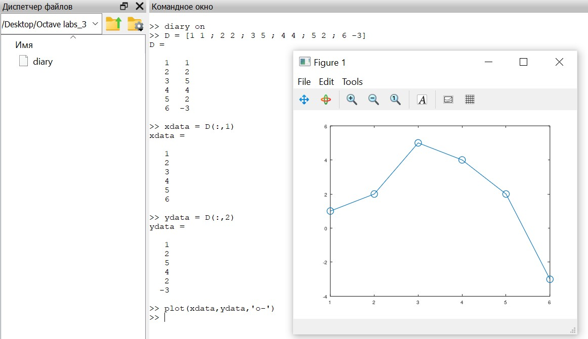
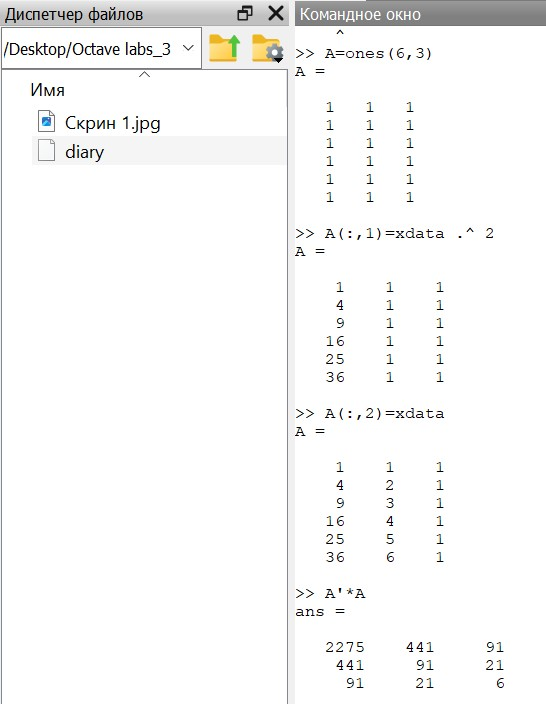
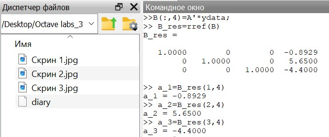
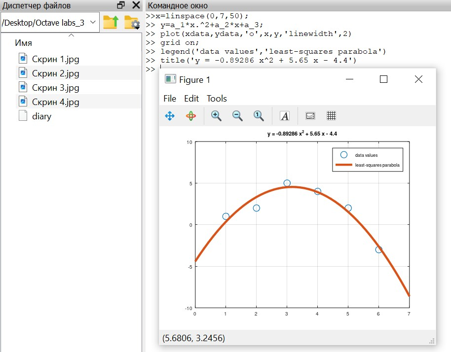
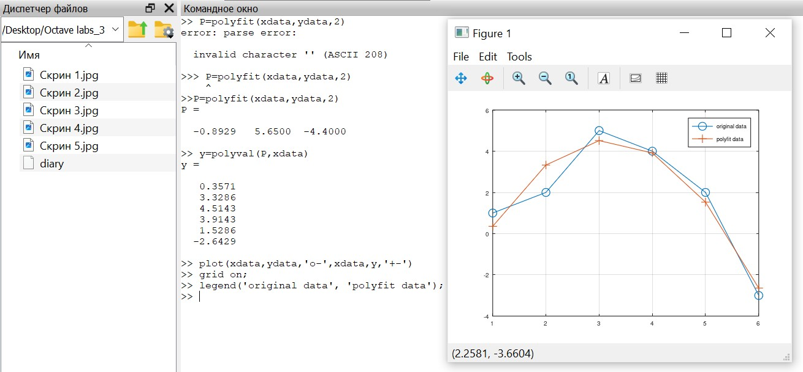
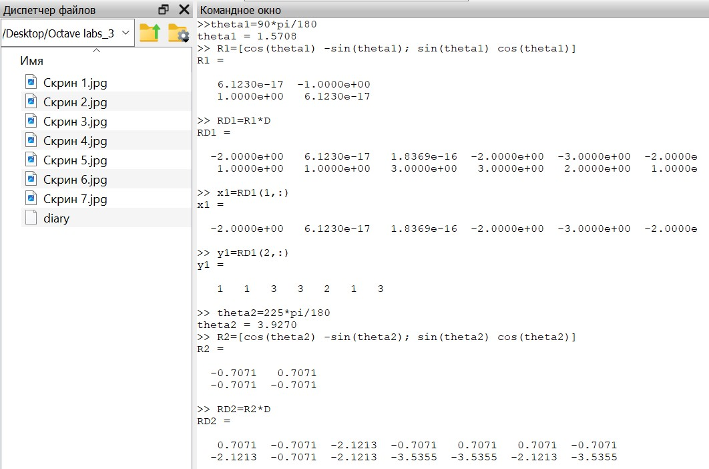

---
## Front matter
lang: ru-RU
title: Лабораторная работа №5
subtitle: Научное программирование
author:
  - Таубер Кирилл Олегович
institute:
  - Российский университет дружбы народов
  - Москва, Россия
date: 3 февраля 2024

## i18n babel
babel-lang: russian
babel-otherlangs: english

## Formatting
mainfont: PT Serif
romanfont: PT Serif
sansfont: PT Sans
monofont: PT Mono
toc: false
slide_level: 2
theme: metropolis
header-includes: 
 - \metroset{progressbar=frametitle,sectionpage=progressbar,numbering=fraction}
 - '\makeatletter'
 - '\beamer@ignorenonframefalse'
 - '\makeatother'
aspectratio: 43
section-titles: true
---

## Цель лабораторной работы

Изучить в Octave методы подгонки полиномиальной кривой, способы представления изображения в виде матрицы и действия над ним: вращение, отражение и дилатацию

## Теоретическое введение

__Интерполяция__ - способ нахождения промежуточных значений величины по имеющемуся дискретному набору известных значений. Интерполяция функций часто встречается при
ограниченности возможностей при проведении эксперимента.

__Аппроксимация__ - замена одних математических объектов другими, в том или ином смысле близкими к исходным. При интерполировании интерполирующая функция строго проходит через узловые точки таблицы вследствие того, что количество коэффициентов в интерполирующей функции равно количеству табличных значений. Аппроксимация – метод приближения, при котором для нахождения дополнительных значений, отличных от табличных данных, приближенная функция проходит не через узлы интерполяции, а между ними.

## Ход выполнения лабораторной работы
- По матрице, в которой заданы значения $x$ в столбце 1 и значения $y$ в столбце 2, рисуем точки на графике

{ #fig:001 width=60% }

## Ход выполнения лабораторной работы
- Строим уравнение вида $y = ax^2 + bx + c$, применяя метод наименьших квадратов и метод Гаусса

{ #fig:002 width=80% }

## Ход выполнения лабораторной работы
- Осуществляем подгонку с помощью встроенных функций: polyfit и polyval

{ #fig:004 width=70% }

## Ход выполнения лабораторной работы
- Строим граф-домик с помощью матрицы, выбрав путь, который проходит по каждому ребру ровно один раз

{ #fig:005 width=70% }

## Ход выполнения лабораторной работы
- Осуществим поворот графа дома на 90 и 225 градусов, переведя углы в радианы, и построим соответствующие графики

{ #fig:006 width=95% }

## Ход выполнения лабораторной работы

- Осуществим отражение графа дома относительно прямой $y=x$, задав матрицу отражения, а также увеличим граф дома в 2 раза

{ #fig:008 width=95% }

## Вывод
- В ходе выполнения данной лабораторной работы я изучил в Octave методы подгонки полиномиальной кривой, способы представления изображения в виде матрицы и действия над ним: вращение, отражение и дилатацию