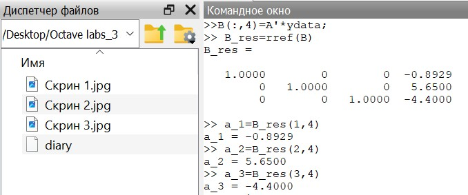
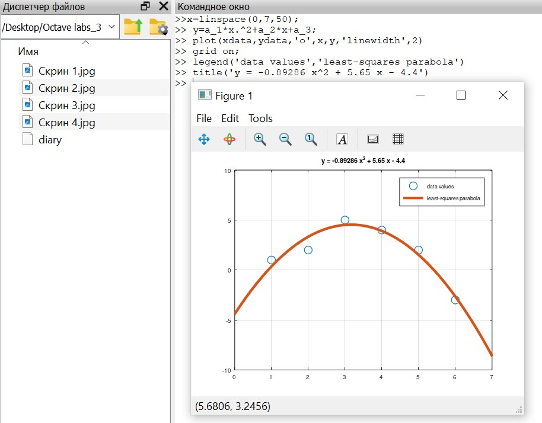
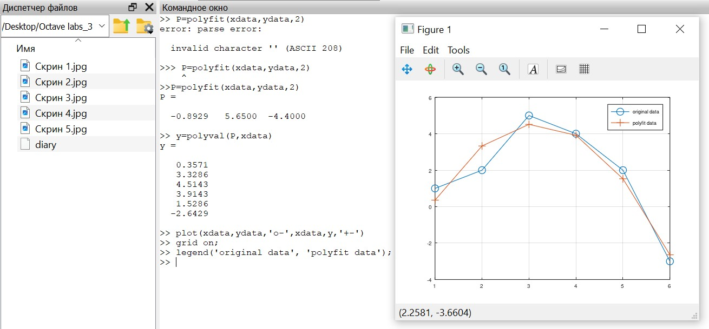
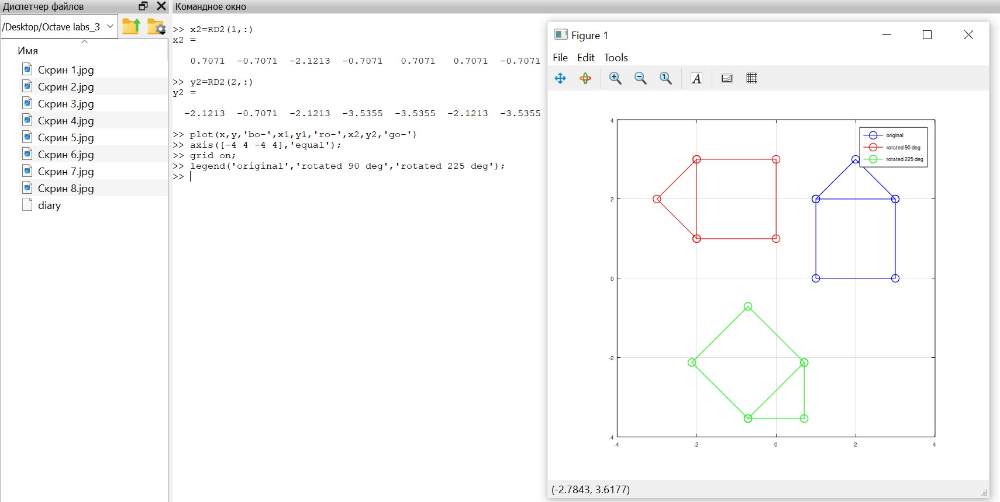

---
## Front matter
title: "Лабораторная работа №5"
subtitle: "Научное программирование"
author: "Таубер Кирилл Олегович"

## Generic otions
lang: ru-RU
toc-title: "Содержание"

## Bibliography
bibliography: bib/cite.bib
csl: pandoc/csl/gost-r-7-0-5-2008-numeric.csl

## Pdf output format
toc: true # Table of contents
toc-depth: 2
lof: true # List of figures
fontsize: 12pt
linestretch: 1.5
papersize: a4
documentclass: scrreprt
## I18n polyglossia
polyglossia-lang:
  name: russian
  options:
	- spelling=modern
	- babelshorthands=true
polyglossia-otherlangs:
  name: english
## I18n babel
babel-lang: russian
babel-otherlangs: english
## Fonts
mainfont: PT Serif
romanfont: PT Serif
sansfont: PT Sans
monofont: PT Mono
mainfontoptions: Ligatures=TeX
romanfontoptions: Ligatures=TeX
sansfontoptions: Ligatures=TeX,Scale=MatchLowercase
monofontoptions: Scale=MatchLowercase,Scale=0.9
## Biblatex
biblatex: true
biblio-style: "gost-numeric"
biblatexoptions:
  - parentracker=true
  - backend=biber
  - hyperref=auto
  - language=auto
  - autolang=other*
  - citestyle=gost-numeric
## Pandoc-crossref LaTeX customization
figureTitle: "Рис."
tableTitle: "Таблица"
listingTitle: "Листинг"
lofTitle: "Список иллюстраций"
lolTitle: "Листинги"
## Misc options
indent: true
header-includes:
  - \usepackage{indentfirst}
  - \usepackage{float} # keep figures where there are in the text
  - \floatplacement{figure}{H} # keep figures where there are in the text
---

# Цель работы

Изучить в Octave методы подгонки полиномиальной кривой, способы представления изображения в виде матрицы и действия над ним: вращение, отражение и дилатацию.

# Теоретическое введение

__Интерполяция__ - способ нахождения промежуточных значений величины по имеющемуся дискретному набору известных значений. Интерполяция функций часто встречается при
ограниченности возможностей при проведении эксперимента. В частности из-за дороговизны и трудоемкости проведения эксперимента размер соответствующей выборки может быть достаточно мал.

__Аппроксимация__ - замена одних математических объектов другими, в том или ином смысле близкими к исходным. При интерполировании интерполирующая функция строго проходит через узловые точки таблицы вследствие того, что количество коэффициентов в интерполирующей функции равно количеству табличных значений. Аппроксимация – метод приближения, при котором для нахождения дополнительных значений, отличных от табличных данных, приближенная функция проходит не через узлы интерполяции, а между ними.

Более подробно см. в [@Octave_1:bash] и [@Octave_2:bash].

# Выполнение лабораторной работы

Найдем параболу по методу наименьших квадратов для набора точек, заданных матрицей

$D =
\begin{bmatrix}
1& 1\\
2& 2\\
3& 5\\
4& 4\\
5& 2\\
6& -3
\end{bmatrix}$.

В матрице заданы значения $x$ в столбце 1 и значения $y$ в столбце 2. Введем матрицу данных в Octave и извлечем вектора $x$ и $y$, затем нарисуем точки на графике (рис. @fig:001).

{#fig:001 width=90%}

Строим уравнение вида $y = ax^2 + bx + c$. Подставляя данные, получаем следующую систему линейных уравнений

$\begin{bmatrix}
1& 1& 1\\
4& 2& 1\\
9& 3& 1\\
16& 4& 1\\
25& 5& 1\\
36& 6& 1
\end{bmatrix}
\begin{bmatrix}
a\\
b\\
c
\end{bmatrix}
=
\begin{bmatrix}
1\\
2\\
5\\
4\\
2\\
-3
\end{bmatrix}$.

Решение по методу наименьших квадратов получается из решения уравнения $A^TAb=A^Ty$, где $b$ - вектор коэффициентов полинома. Строим соответствующие уравнения. Затем решаем задачу методом Гаусса, записав предварительно расширенную матрицу

$B=
\begin{bmatrix}
2275& 441& 91& 60\\
441& 91& 21& 28\\
91& 21& 6& 11
\end{bmatrix}$.

В итоге получаем искомое квадратное уравнение вида: 

$y = -0.89286x^2 + 5.65x - 4.4$. 

Строим соответствующий график параболы (рис. @fig:002) - (рис. @fig:005).

{#fig:002 width=90%}

{#fig:003 width=90%}

{#fig:004 width=90%}

{#fig:005 width=90%}

Процесс подгонки может быть автоматизирован встроенными функциями Octave. Для этого используется встроенная функция для подгонки полинома polyfit. Значения полинома P в точках, задаваемых вектором-строкой x можно получить с помощью функции polyval. Получим подгоночный полином и рассчитаем значения полинома в точках, а затем построим исходные и подгоночные данные на графике (рис. @fig:006).

{#fig:006 width=90%}

Строим граф-домик с помощью матрицы, выбрав путь, который проходит по каждому ребру ровно один раз (цикл Эйлера) (рис. @fig:007):

$D =
\begin{bmatrix}
1& 1& 3& 3& 2& 1& 3\\
2& 0& 0& 2& 3& 2& 2
\end{bmatrix}$.

{#fig:007 width=90%}

Осуществим поворот графа дома на 90 и 225 градусов, переведя углы в радианы, и построим соответствующие графики (рис. @fig:008) и (рис. @fig:009).

{#fig:008 width=90%}

{#fig:009 width=90%}

Осуществим отражение графа дома относительно прямой $y=x$, задав матрицу отражения (рис. @fig:010).

{#fig:010 width=90%}

Увеличим граф дома в 2 раза (рис. @fig:011).

{#fig:011 width=90%}

# Вывод 

В ходе выполнения данной лабораторной работы я изучил в Octave методы подгонки полиномиальной кривой, способы представления изображения в виде матрицы и действия над ним: вращение, отражение и дилатацию.